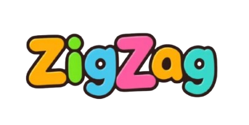

# ZigZag : Learn Smart, Teach Smart !

<p align="center">
  
</p>


ZigZag is an innovative application that combines generative artificial intelligence with education. It offers a dual-interface system:

- **For children** : Interactive, age-appropriate games that stimulate learning while identifying strengths and weaknesses (learning difficulties, dyslexia, etc.).
- **For educators** : A dedicated virtual assistant that analyzes children's data and provides personalized advice along with optimized teaching methods.

## 🌟 Objectives

### Helping children
- Provide educational content tailored to each child.
- Adhere to WHO’s recommended screen time guidelines (maximum 30 minutes per day).

### Supporting educators
- Deliver personalized teaching advice based on collected data.
- Integrate suitable educational materials.

### Enhancing efficiency
- Reduce educators’ workload.
- Optimize resources in nurseries and schools.

## 🔀 Features

### For children :
- **Personalized educational games** :
  - *Wordsearch* : Customized word search puzzles based on difficulty level.
  - *Mathematical equations* : Dynamically generated equations tailored to each child's ability.
- **Tracking and analysis** :
  - Data collection on performance to identify learning difficulties.

### For educators :
- **Educational chatbot** :
  - Provides advice on teaching methods tailored to each child.
  - Analyzes progress and individual needs.
- **Detailed reports** :
  - Data visualization for improved child monitoring.

## 💻 Technologies Used

### Frontend :
- Unity for educational games interfaces.

### Backend :
- API OpenAI (GPT-4 for chatbot, DALL-E for image generation).
- ASP.NET Core for data management and interactions.
- SocketIO.
- Docker.

## 📦 Installation & Execution

### Prerequisites :
- .NET SDK 6.0 or later.
- Unity installed on your machine.
- OpenAI API Key (to be added in a `.env` file).

### Steps :

1. Clone the projet :
   ```bash
   git clone https://github.com/omar-belhaj/CoddsCoders.git
   cd CoddsCoders
   ```
2. Configure the OpenAI API key: :
   - Create a `.env` file in the root directory and add: :
     ```
     OPENAI_API_KEY=your-api-key
     ```

## 🚀 Deployment with Docker

### 1. Build & deploy a Docker image for ZigZag
The goal is to create a Streamlit chatbot interface for ZigZag and deploy it on Google Cloud Platform (GCP).

### 1.1 Local testing

#### **A. Create & test the Streamlit application locally**
1. Create an `app.py` file containing the Streamlit application code..
2. Run the application locally :
   ```bash
   streamlit run app.py
   ```

#### **B. Build the Docker image**
1. Ensure the `Dockerfile` is properly configured.
2. Build a Docker image :
   ```bash
   docker build -t streamlit:zigzag .
   docker run --name zigzag_chatbot -p 8502:8501 streamlit:zigzag
   ```
3. To stop and restart the container :
   ```bash
   docker stop zigzag_chatbot
   docker rm zigzag_chatbot
   docker run -p 8502:8501 streamlit:zigzag
   ```

## 📊 Business Model

The application operates on a monthly subscription model :
- **For nurseries & schools** : Pricing is based on the number of children and educators.
- **Benefits for institutions** :
  - Saves time and enhances efficiency for educators.
  - Improves monitoring of children with learning difficulties.

## 🛠 Contributions

Contributions are welcome ! Please open an *issue* or submit a *pull request* for any improvements or suggestions.

## 🌐 Contact

For any inquiries or partnership requests, contact us :

- 📧 Email :
  - gatti.aziz55@gmail.com
  - youssefeloued789@gmail.com
  - mohamedkhaled.dridi2@gmail.com
  - rodrigue.migniha@dauphine.tn
  - adamfatnassi110@gmail.com
  - omarbelhadj220@gmail.com
- 🌍 GitHub : [ZigZag](https://github.com/omar-belhaj/ZigZag)
